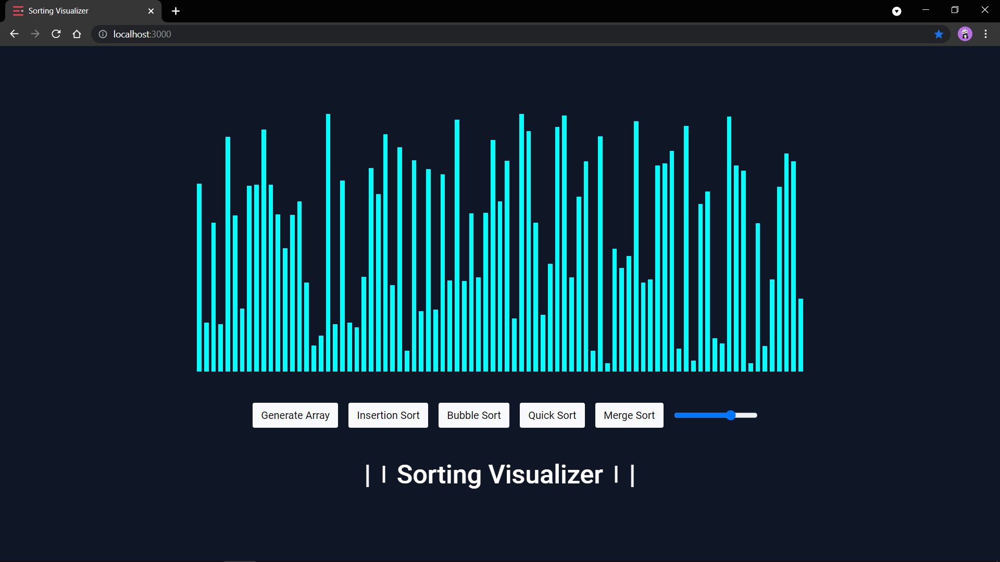
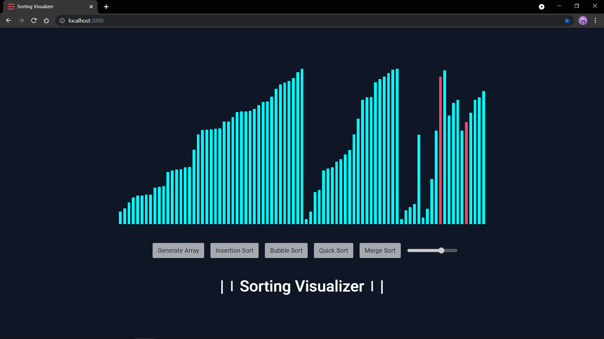
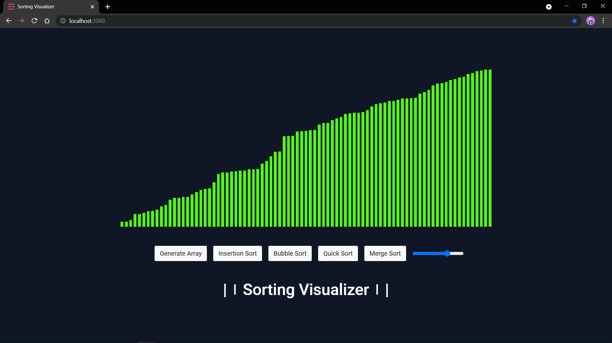

# Sorting Visualizer

A Sorting Visualizer written in React.

**Here is a Demo** :rocket: [Sorting-Visualizer](https://arpitsandal.github.io/Sorting-Visualizer-React/)

We can visualize several sorting algorithms such as Bubble Sort, Merge Sort and Quick Sort etc.

Here are some samples :rocket:











# Installation

1. Clone the respository: ```git clone https://github.com/ArpitSandal/Sorting-Visualizer-React.git```

2. cd into the project folder and type: ```npm install```

4. Run the local server using: ```npm start```

5. View in browser at: ```http://localhost:3000/```